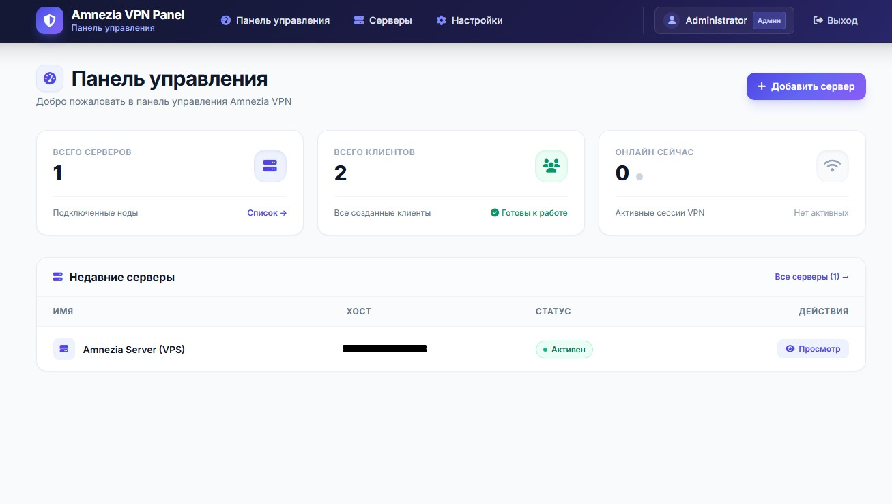
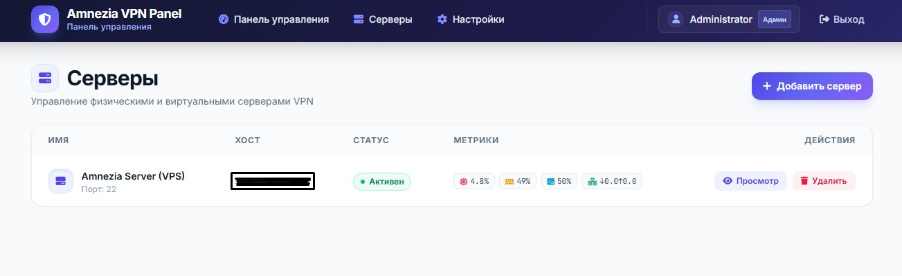
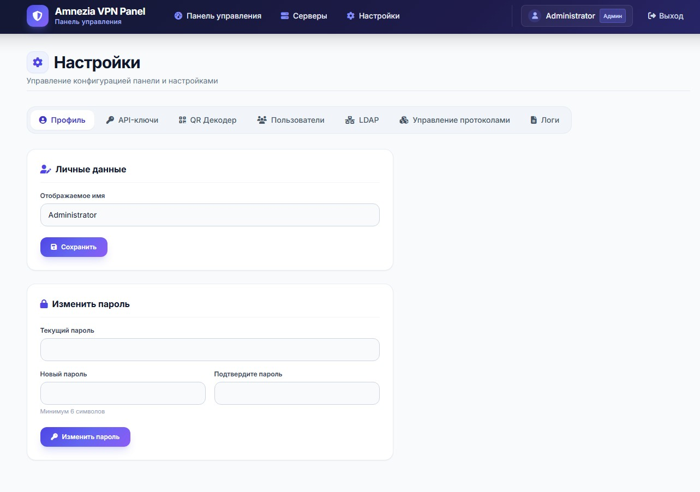
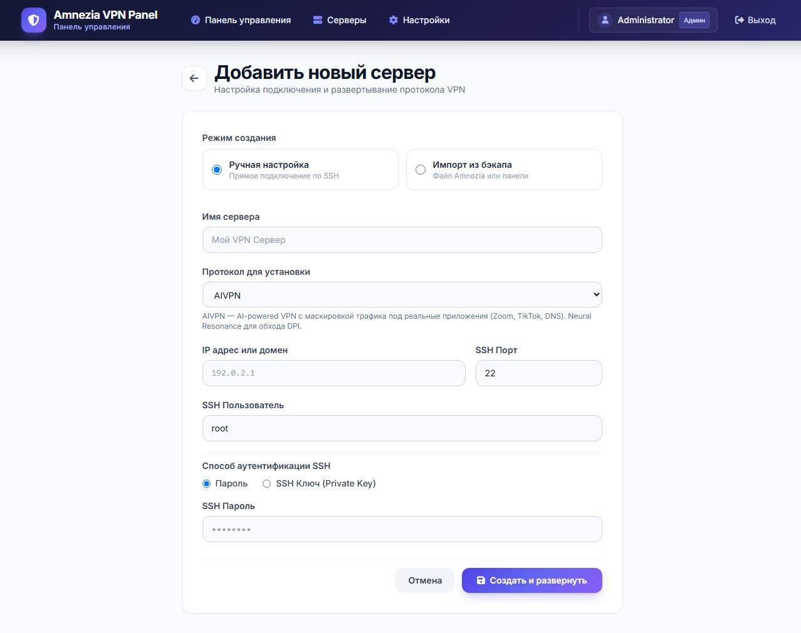
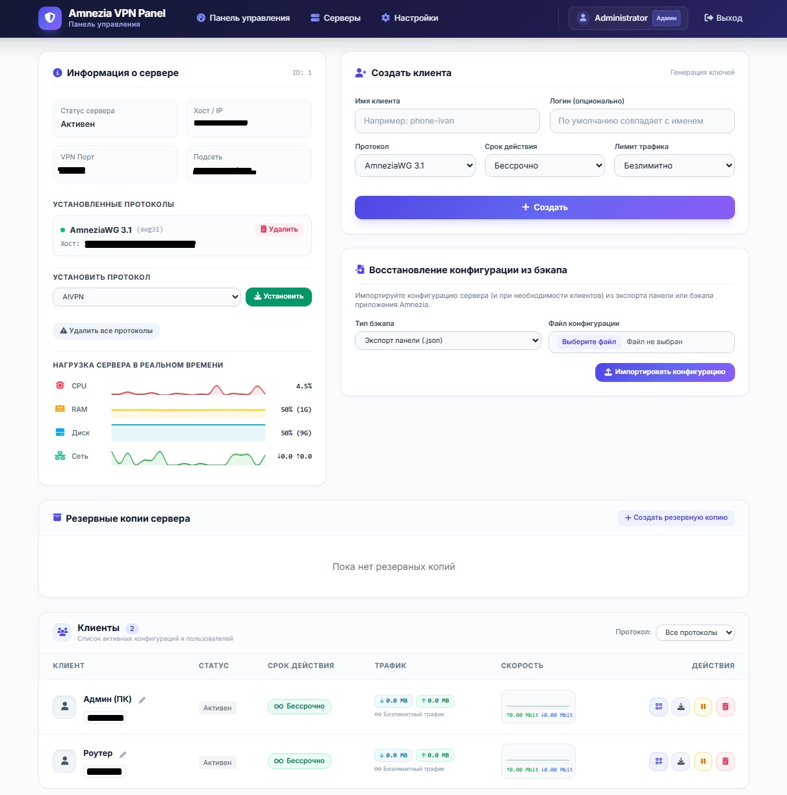

# 🛡️ Amnezia VPN Control Panel

Современная веб-панель управления VPN-серверами на базе **AmneziaWG (3.1 / 2.0)**, **WireGuard** и **XRay VLESS**.

Позволяет централизованно управлять несколькими VPN-серверами, создавать клиентов, генерировать QR-коды для приложения Amnezia, устанавливать ограничения трафика и сроков действия, а также отслеживать статистику в реальном времени.

---

## ✨ Основные возможности

* 🚀 **Поддержка современных протоколов:**
  * **AmneziaWG 3.1** и **2.0** (с защитой от DPI и настраиваемыми Junk-пакетами)
  * **WireGuard Standard**
  * **XRay VLESS Reality**
  * **Cloudflare WARP Proxy**
  * **OpenVPN**, **Shadowsocks**, **MTProxy (Telegram)**
* 📱 **Полная совместимость с приложением Amnezia:**
  * Генерация нативных QR-кодов и составных кодов для мобильных и десктоп-клиентов
  * Экспорт и импорт резервных копий (`.backup` и `.json`)
  * Импорт существующих серверов без сброса настроек и разрыва связи у клиентов
* ⏱️ **Управление клиентами:**
  * Установка сроков действия (с автоотключением)
  * Лимиты трафика (с автоблокировкой при превышении)
  * Быстрое переименование и статус активности в реальном времени (Online/Offline)
* 📊 **Мониторинг сервера:**
  * Графики нагрузки CPU, RAM, диска и скорости сети (Мбит/с) в реальном времени
* 🇷🇺 **Полностью русскоязычный интерфейс:**
  * Чистый дизайн на Tailwind CSS
  * Шрифты Inter и JetBrains Mono с поддержкой кириллицы
  * Удобная таблица клиентов без горизонтальных скроллбаров

---

## 📸 Скриншоты интерфейса

<div align="center">
  
  <p><em>Главный экран панели управления</em></p>
  <br/>
  
  <p><em>Управление сервером, протоколами и список клиентов</em></p>
  <br/>
  
  <p><em>Настройки системы и управление протоколами</em></p>
  <br/>
  
  <p><em>Конфигурация клиента и QR-код</em></p>
  <br/>
  
  <p><em>Управление и мониторинг</em></p>
</div>

---

## ⚡ Быстрая установка на VPS (1 команда)

Подключитесь к вашему чистому серверу (Ubuntu 20.04 / 22.04 / 24.04 или Debian 11 / 12) по SSH и выполните:

```bash
bash <(curl -sSL https://raw.githubusercontent.com/pashkatara/amnezia-control-panel/main/install.sh)
```

Скрипт автоматически:
1. Установит Docker и Docker Compose (если они не установлены).
2. Развернет панель и базу данных.
3. Выдаст ссылку и данные для входа.

---

## 🛠️ Ручная установка через Docker Compose

1. **Клонируйте репозиторий:**
   ```bash
   git clone https://github.com/pashkatara/amnezia-control-panel.git /opt/amnezia-panel
   cd /opt/amnezia-panel
   ```

2. **Создайте файл `.env`:**
   ```bash
   cp .env.example .env
   ```

3. **Запустите контейнеры:**
   ```bash
   docker compose up -d --build
   ```

4. **Откройте панель в браузере:**
   * **URL:** `http://IP_ВАШЕГО_СЕРВЕРА:8082`
   * **Email:** `admin@amnez.ia`
   * **Пароль:** `admin123`

---

## 🔄 Обновление панели

Для обновления панели до последней версии выполните в папке проекта:

```bash
cd /opt/amnezia-panel
./update.sh
```

---

## 🗑️ Удаление панели с сервера (1 команда)

Если вам потребуется полностью удалить панель управления с сервера:

```bash
bash <(curl -sSL https://raw.githubusercontent.com/pashkatara/amnezia-control-panel/main/uninstall.sh)
```

Скрипт остановит и удалит Docker-контейнеры панели, базу данных, закроет порт в файрволе и очистит папку `/opt/amnezia-panel`. При этом ваши VPN-контейнеры с клиентами останутся нетронутыми.

---

## 📋 Системные требования

* **ОС:** Linux (Ubuntu 20.04+, Debian 11+, CentOS 8+, AlmaLinux)
* **Процессор:** 1 ядро
* **Память:** от 1 ГБ RAM
* **Диск:** от 5 ГБ свободного места
* **Установленный Docker и Docker Compose**

---

## 🔒 Безопасность

* После первого входа обязательно **смените пароль администратора** в разделе **Настройки → Профиль**.
* При необходимости измените стандартный порт `8082` в `docker-compose.yml`.

---

## 🛠️ Структура проекта

* `templates/` — Twig-шаблоны страниц с интерфейсом на русском языке.
* `inc/` — Ядро управления серверами, клиентами, SSH-сессиями и протоколами.
* `controllers/` — Контроллеры веб-панели и API.
* `migrations/` — Миграции базы данных MySQL.
* `install.sh` — Скрипт автоматической установки в 1 команду.
* `update.sh` — Скрипт обновления панели.

---

## 📄 Лицензия

Проект распространяется под свободной лицензией [MIT](LICENSE).

# amneziavpnphp
